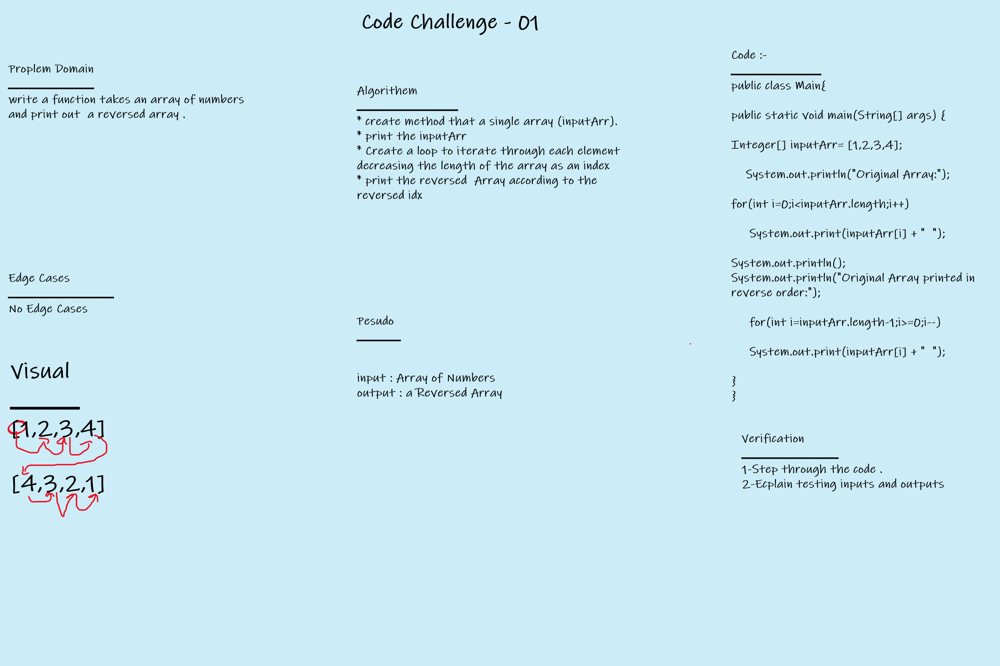

# Code Challenge - 01
***


***
# Code Snippet
``` 
public class Main{

public static void main(String[] args) {

Integer[] intArray = [1,2,3,4];

    System.out.println("Original Array:");

for(int i=0;i<intArray.length;i++)

     System.out.print(intArray[i] + "  ");
 
System.out.println();
System.out.println("Original Array printed in reverse order:");

     for(int i=intArray.length-1;i>=0;i--)

     System.out.print(intArray[i] + "  ");

}
}
```
# Code Challenge 02

**Array-insert-shift**

